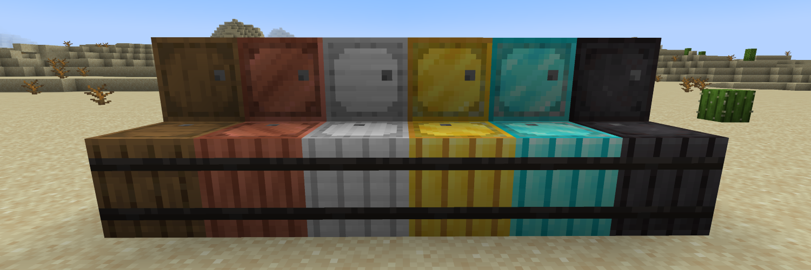

# Reinforced Barrels — Minecraft 26.1.2 Port

> **This is an unofficial port of Reinforced Barrels by Aton-Kish for Minecraft 26.1.2.**

This project maintains **Reinforced Barrels** for newer versions of Minecraft. The original mod was created by **Aton-Kish**.

This repository contains the changes necessary to port the original mod to **Minecraft 26.1.2 using Fabric**.

## Original Project

**Original Author:** Aton-Kish

**Original Repository:**
https://github.com/Aton-Kish/reinforced-barrels

**Original Modrinth Page:**
https://modrinth.com/mod/reinforced-barrels

**Original CurseForge Page:**
https://www.curseforge.com/minecraft/mc-mods/reinforced-barrels

The original project is licensed under the **MIT License**. The original copyright and license information are preserved in this repository.

## Minecraft 26.1.2

* **Minecraft:** 26.1.2
* **Mod Loader:** Fabric
* **Port:** Unofficial community port
* **Original Mod:** Reinforced Barrels by Aton-Kish
* **Original Version:** v4.09+1.21.11

This project is intended to keep the mod available for newer Minecraft versions when the original project does not yet support them.

## Features

Reinforced Barrels adds reinforced barrel variants with progressively larger inventories:

| Barrel           | Inventory |
| ---------------- | --------: |
| Copper Barrel    |  45 slots |
| Iron Barrel      |  54 slots |
| Gold Barrel      |  81 slots |
| Diamond Barrel   | 108 slots |
| Netherite Barrel | 108 slots |

The Netherite Barrel is resistant to blast, fire, and lava.

## Installation

1. Install **Minecraft 26.1.2**.
2. Install the **Fabric Loader** for Minecraft 26.1.2.
3. Install the required version of **Fabric API**.
4. Install **Reinforced Core** for Minecraft 26.1.2.
5. Place the Reinforced Barrels `.jar` file in your Minecraft `mods` folder.
Reinforced Core is required for Reinforced Barrels to function.

## Reinforced Storage Mod Series

Reinforced Barrels is part of the Reinforced Storage Mod Series created by Aton-Kish.

* [Reinforced Chests](https://github.com/Aton-Kish/reinforced-chests)
* [Reinforced Shulker Boxes](https://github.com/Aton-Kish/reinforced-shulker-boxes)
* [Reinforced Core](https://github.com/Aton-Kish/reinforced-core)

## ## Configuration

The original project provides configuration through **Reinforced Core** and Mod Menu.

The Reinforced Core 26.1.2 port is functional, but **Mod Menu integration has not yet been confirmed working on Minecraft 26.1.2**.

The configuration options will be documented here once Mod Menu support has been verified.

## Porting and Maintenance

This repository is maintained as an unofficial compatibility port.

The goal of this project is to preserve the original mod's functionality while updating it for newer Minecraft versions.

Gameplay changes are not intentionally introduced as part of the porting process.

## License

The original Reinforced Barrels source code is licensed under the **MIT License**.

Copyright (c) 2021 Aton-Kish

See [LICENSE](./LICENSE) for the complete license text.

## Credits

**Original mod:** Reinforced Barrels
**Original author:** Aton-Kish

This project is not affiliated with or endorsed by Aton-Kish unless otherwise stated.

